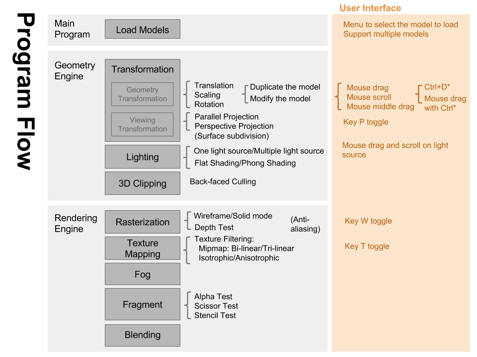

# 3D Graphics Pipeline

A program to read and show given 3D model files (.obj) with rasterization and lighting.

[3DMM Final Proposal on Google Slides](https://docs.google.com/presentation/d/1ktccoMu1ihUhZ7n7Hlv9xIq7cAkNMgr-hRX6ejyMrG4/edit?usp=sharing)

### How to compile & execute

#### Command Line

OpenGL/freeglut is needed to compile the program.
To compile the program, run command:

`make`

And the executable file will appear in the working directory.

To remove the program, run command:

`make clean`

Run the program:

`./3d-graphics-engine`

#### Visual Studio
1. Open Visual Studio 2010 or newer version of Visual Studio.
2. Add all the header files to the header folder of the solution explorer.
3. Add all the source files to the source folder of the solution explorer.
4. Switch the compiling mode to "Release" mode.
5. Press F5 to start debugging.

### How to use the program

After you start running the program, hit `h` to view the hotkeys.
