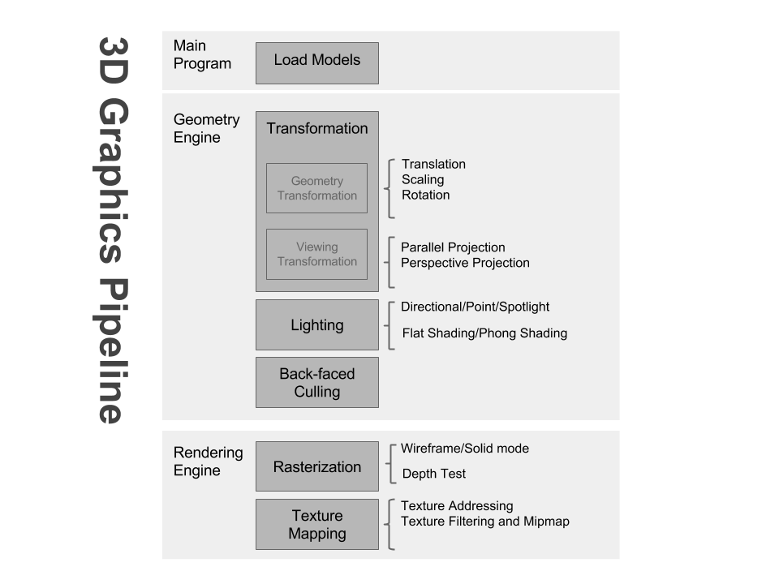

# 3D Graphics Pipeline

A program to read and show given 3D model files (.obj) with rasterization and lighting.

### Screenshots

### How it works

### How to compile & execute

Qt5 is needed to compile the program.
To compile the program, run command:

`qmake-qt5 3d-graphics-engine.pro`

`make`

And the executable file will appear in the working directory.

To remove the program, run command:

`make clean`

Run the program:

`./3d-graphics-engine`
